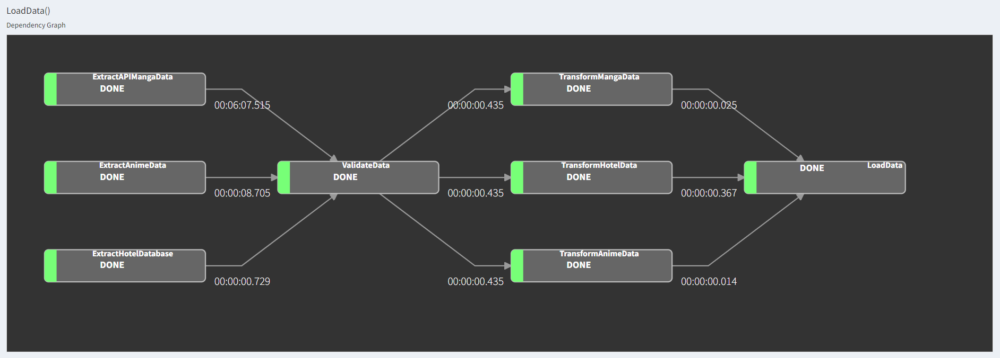

# Live Class Luigi Pacmann

- Repository untuk Live Class Week 7 course Intro to Data Engineer Pacmann
- Sudah disediakan `run_etl.sh` untuk membuat scheduler dengan menggunakan Cron, kalian bisa menyesuaikan dengan lokal masing - masings

### Data Source
---

- Hotel Data: https://hub.docker.com/r/shandytp/hotel-booking-docker-db 
- Anime Data: https://myanimelist.net/anime/season/2024/winter
- Manga Data: https://api.jikan.moe/v4/manga/{id}/full

### Luigi Pipeline Output
---

